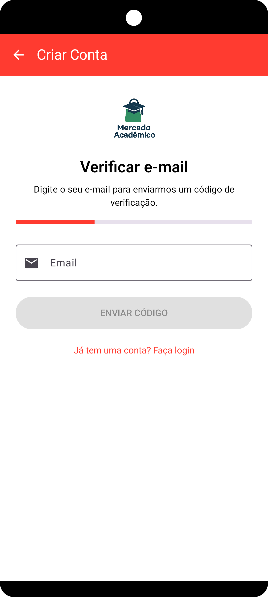
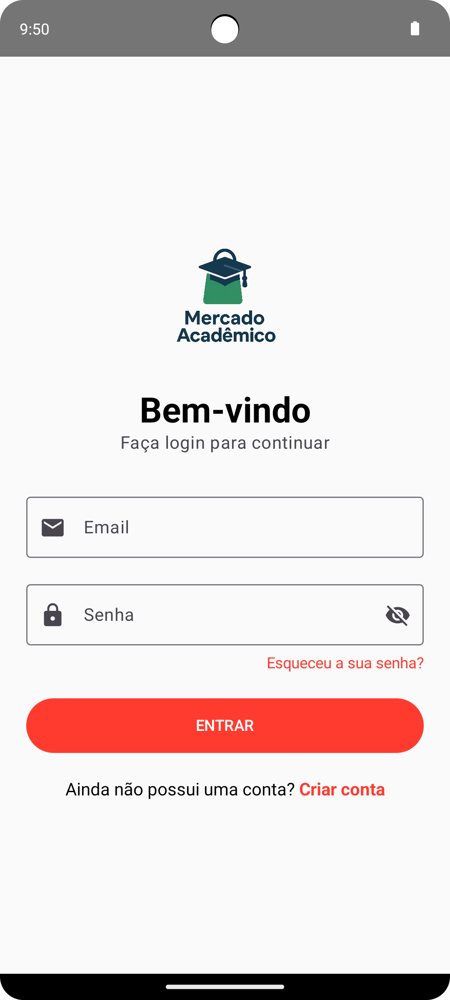

# Manual do Utilizador  
## Aplicação Mercado Académico

---

## 1. Introdução

O **Mercado Académico** é uma aplicação móvel desenvolvida com o objetivo de facilitar a compra, venda e negociação de materiais académicos entre estudantes do ensino superior.  

Este manual tem como finalidade explicar, de forma simples e prática, como utilizar as principais funcionalidades da aplicação, desde o registo até à realização de compras e vendas.

A aplicação foi desenvolvida para dispositivos **Android**.

---

## 2. Registo de Utilizador

Ao abrir a aplicação pela primeira vez, o utilizador pode criar uma nova conta.

### Passos para registo:
1. Selecionar a opção **Criar Conta**;
2. Introduzir o endereço de email;
3. Receber um **código de verificação por email**;
4. Inserir o código recebido;
5. Preencher os dados pessoais (nome, telefone e palavra-passe);
6. Confirmar o registo.

Após este processo, a conta fica ativa e pronta a ser utilizada.

---

## 3. Login

Depois de concluído o registo, o utilizador pode iniciar sessão na aplicação.

### Para iniciar sessão:
1. Introduzir o email;
2. Introduzir a palavra-passe;
3. Selecionar **Entrar**.

Se os dados estiverem corretos, o utilizador é redirecionado para a página inicial.

---

## 4. Recuperação de Palavra-passe

Caso o utilizador se esqueça da palavra-passe, pode recuperá-la através do email.

### Passos:
1. Selecionar **Esqueci-me da palavra-passe**;
2. Introduzir o email associado à conta;
3. Receber um código de recuperação por email;
4. Inserir o código e definir uma nova palavra-passe.

---

## 5. Página Inicial (Home)

A página inicial apresenta todos os produtos disponíveis na aplicação.

Funcionalidades disponíveis:
- Visualização da lista de produtos;
- Pesquisa por nome do produto;
- Filtro por categoria;
- Ordenação por preço ou data;
- Marcação de produtos como favoritos.

Ao selecionar um produto, o utilizador pode aceder aos seus detalhes.

---

## 6. Detalhes do Produto

Na página de detalhes do produto é possível consultar todas as informações relevantes.

Funcionalidades disponíveis:
- Visualizar imagens do produto;
- Ver o título, descrição e preço;
- Consultar a categoria;
- Enviar uma proposta de negociação;
- Adicionar ou remover o produto dos favoritos.

---

## 7. Envio de Propostas

A aplicação permite a negociação do preço através do envio de propostas.

### Para enviar uma proposta:
1. Aceder aos detalhes do produto;
2. Selecionar **Enviar Proposta**;
3. Introduzir o valor pretendido;
4. Confirmar o envio.

O vendedor poderá aceitar ou recusar a proposta.

---

## 8. Mensagens

O Mercado Académico possui um sistema interno de mensagens associado às propostas.

Funcionalidades:
- Enviar mensagens entre comprador e vendedor;
- Consultar o histórico de mensagens;
- Acompanhar o estado da proposta (pendente, aceite ou recusada).

---

## 9. Compra de Produtos

Quando uma proposta é aceite ou o utilizador decide comprar diretamente, é possível realizar o pagamento.

### Processo de compra:
1. Selecionar **Comprar**;
2. Confirmar os dados do produto;
3. Efetuar o pagamento através da plataforma **Stripe**;
4. Receber a confirmação de pagamento.

Após a compra, o produto é removido da página inicial.

---

## 10. Minhas Compras

Nesta secção, o utilizador pode consultar os produtos adquiridos.

Funcionalidades:
- Visualizar o histórico de compras;
- Consultar detalhes dos produtos adquiridos;
- Acompanhar transações realizadas.

---

## 11. Minhas Vendas

Os utilizadores que publicam produtos podem consultar as suas vendas.

Funcionalidades:
- Visualizar produtos vendidos;
- Consultar histórico de vendas;
- Acompanhar propostas recebidas.

Produtos já vendidos deixam de aparecer na página inicial.

---

## 12. Favoritos

A funcionalidade de favoritos permite guardar produtos de interesse.

Funcionalidades:
- Marcar produtos como favoritos;
- Aceder rapidamente aos produtos guardados;
- Remover produtos dos favoritos.

---

## 13. Perfil do Utilizador

Na área de perfil é possível gerir os dados da conta.

Funcionalidades disponíveis:
- Visualizar dados pessoais;
- Editar nome e telefone;
- Atualizar foto de perfil;
- Terminar sessão.

---

## 14. Logout

Para terminar a sessão na aplicação:

1. Aceder ao perfil do utilizador;
2. Selecionar **Terminar Sessão**.

O utilizador será redirecionado para o ecrã de login.

---
